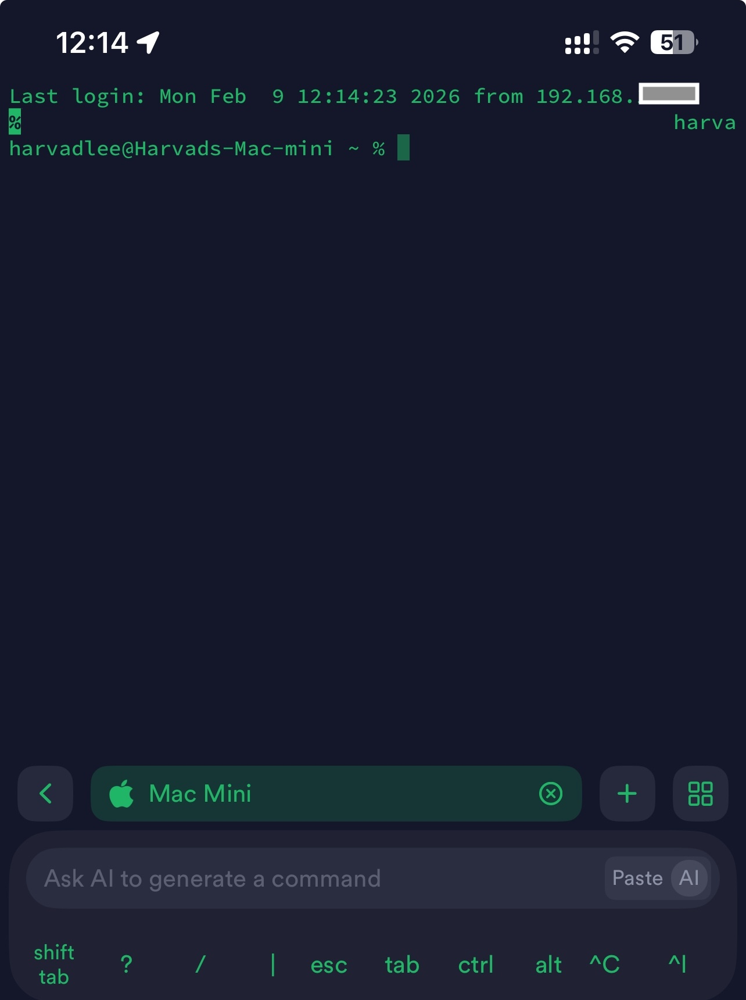
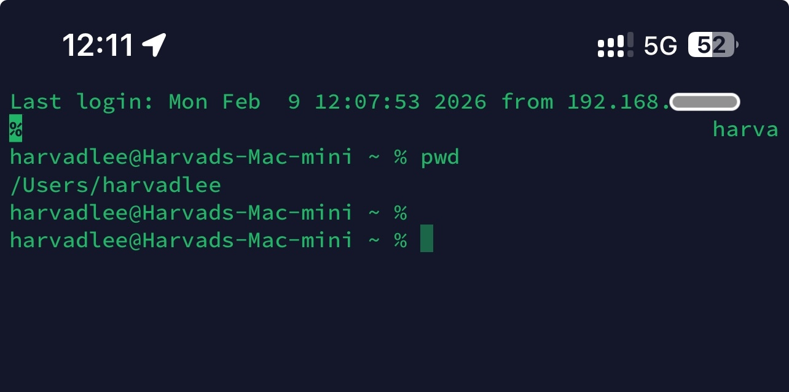
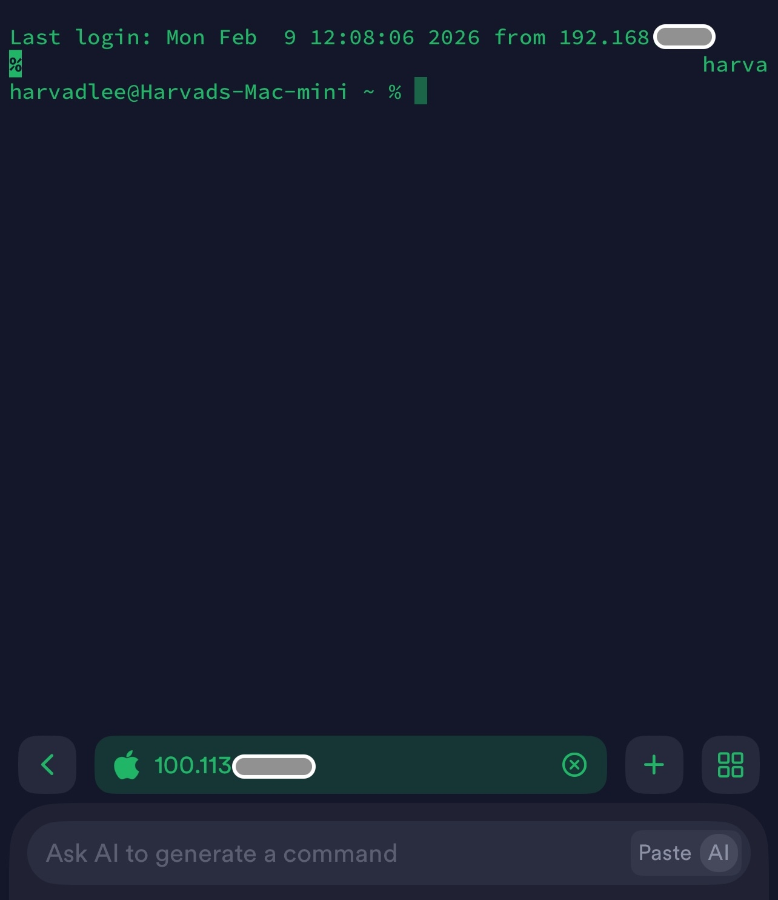
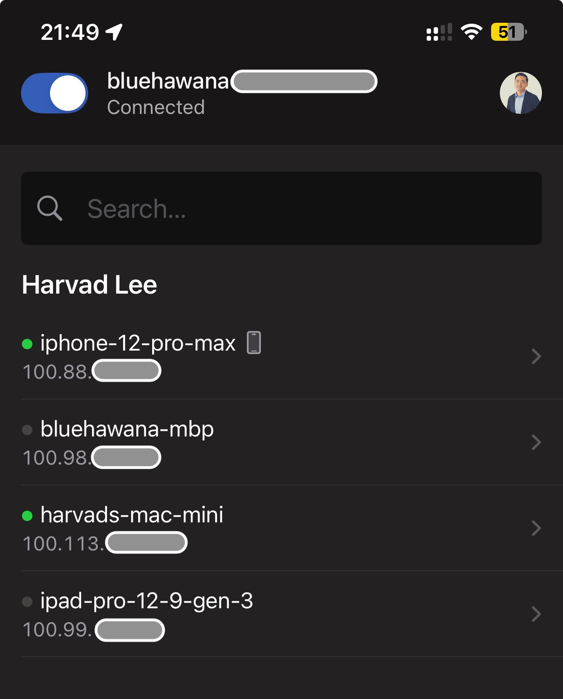
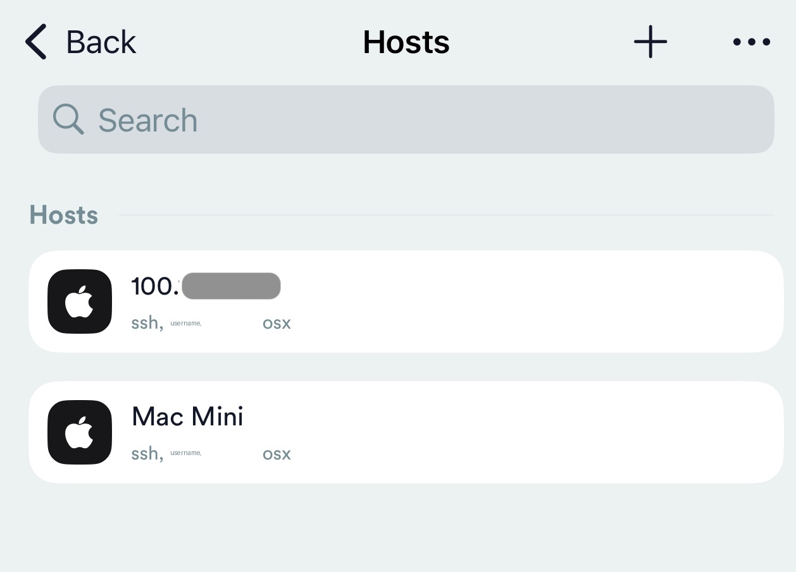
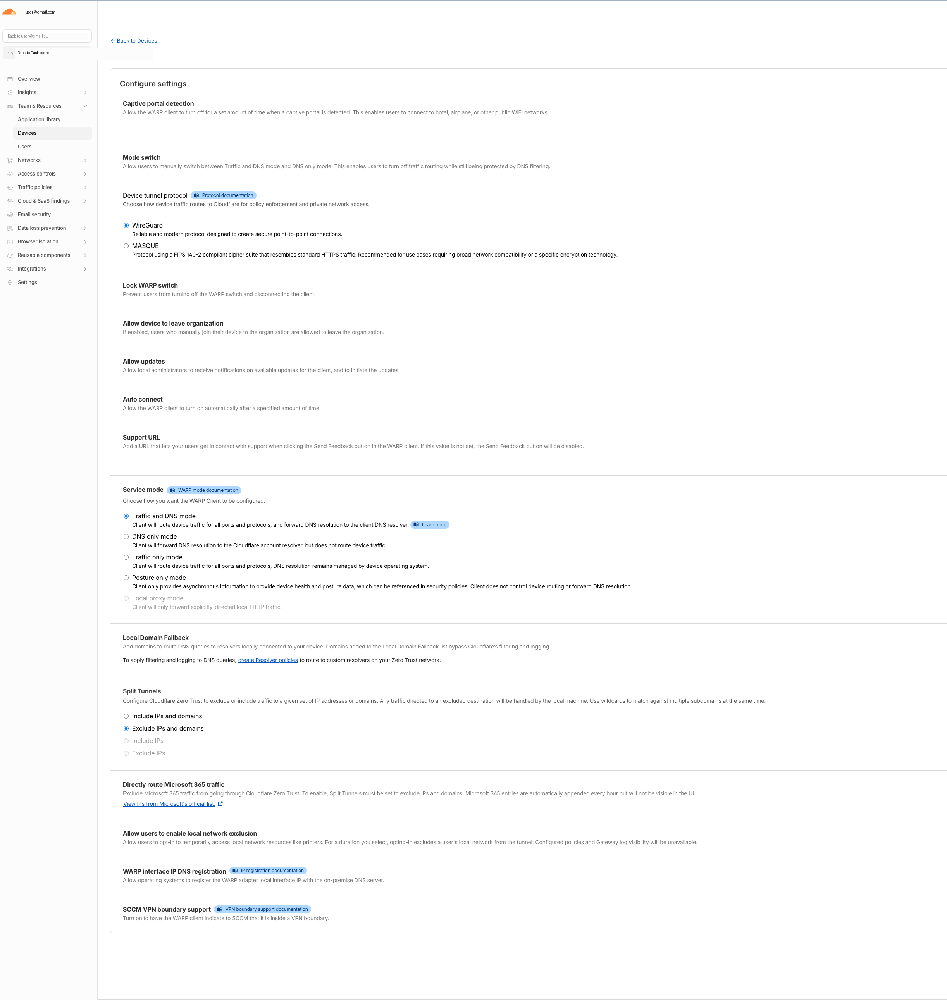

# Homeserver SSH Anywhere

> SSH into your home server from anywhere -- your phone, a hotel bed, or a coffee shop -- without exposing a single port to the internet.

5 connection methods + resilience layers (tmux, ProxyJump, mobile AI). From "same WiFi only" to "fix my server from a hotel bed with voice commands."

> *[Why this guide exists](docs/real-world-story.md): a service crashed during vacation. The rescue happened entirely from a phone.*

---

## TL;DR -- Pick Your Method

| # | Method | Setup Time | Works Outside Home? | Best For |
|---|--------|-----------|-------------------|----------|
| 1 | [WiFi Direct](#method-1-direct-wifi) | 2 min | No | Home network only |
| 2 | [Cloudflare Browser SSH](#method-2-cloudflare-browser-ssh) | 30 min | Yes | Zero-install browser access |
| 3 | [Cloudflare WARP](#method-3-cloudflare-warp--termius) | 60 min | Yes | Full Zero Trust with native SSH |
| 4 | [Tailscale](#method-4-tailscale--termius) | 5 min | Yes | Simplest remote SSH |
| 5 | [SSH ProxyJump](#method-5-ssh-proxyjump) | 10 min | Yes (via jump host) | Reaching machines without VPN |

**Just want it working fast?** Start with [Method 4 (Tailscale)](#method-4-tailscale--termius).
**Want Zero Trust security?** Go with [Method 2](#method-2-cloudflare-browser-ssh) or [Method 3](#method-3-cloudflare-warp--termius).

---

## Method 1: Direct WiFi

```
+------------------+          same WiFi           +------------------+
|   iPhone         +----------------------------->+    Your Mac      |
|   Termius        |       192.168.1.x:22         |   SSH enabled    |
|                  +<-----------------------------+                  |
+------------------+                              +------------------+
```

Same network, direct SSH. The baseline -- useless once you leave home.

```bash
bash scripts/01-setup-mac-ssh.sh
```

> [Full setup guide](docs/method-1-wifi-direct.md)

---

## Method 2: Cloudflare Browser SSH

```
+------------------+        +-------------------+        +------------------+
|   Any Device     |  HTTPS |  Cloudflare Edge  |  QUIC  |    Your Mac      |
|                  +------->+                   +------->+                  |
|  Any browser     |        |  Zero Trust Auth  |        |  cloudflared     |
|                  |        |  Email OTP        |        |  (tunnel daemon) |
|                  |<-------+  Browser Terminal  |<-------+       |          |
|  Terminal in     |  HTTPS |                   |  QUIC  |       v          |
|  browser         |        |                   |        |  SSH localhost:22 |
+------------------+        +-------------------+        +------------------+
```

Open a URL, verify your email, get a terminal. **Zero apps needed.** Your Mac connects outbound only -- nothing exposed.

```bash
bash scripts/02-setup-cloudflared.sh
bash scripts/02b-configure-zero-trust.sh
```

> [Full setup guide](docs/method-2-cloudflare-browser-ssh.md)

---

## Method 3: Cloudflare WARP + Termius

```
+------------------+        +-------------------+        +------------------+
|   iPhone         |  WARP  |  Cloudflare Edge  |  QUIC  |    Your Mac      |
|                  +------->+                   +------->+                  |
|  1.1.1.1 app     |  VPN   |  Gateway Proxy    |        |  cloudflared     |
|  (Zero Trust)    | tunnel |  Split Tunnel     |        |  (warp-routing)  |
|       +          |        |  192.168.x → tun  |        |       |          |
|  Termius         |<-------+                   |<-------+       v          |
|  SSH 192.168.1.x |  WARP  |                   |  QUIC  |  SSH localhost:22 |
+------------------+        +-------------------+        +------------------+
```

Native SSH from your phone over cellular. Full Zero Trust. **Hardest to set up** but the most secure.

```bash
bash scripts/02b-configure-zero-trust.sh
```

> [Full setup guide](docs/method-3-cloudflare-warp.md) -- the critical steps most people miss are documented here.

---

## Method 4: Tailscale + Termius

```
+------------------+        +-------------------+        +------------------+
|   iPhone         | WireGd |  Tailscale DERP   | WireGd |    Your Mac      |
|                  +------->+  (coordination)   +------->+                  |
|  Tailscale app   |        |  or direct P2P    |        |  Tailscale app   |
|       +          |        |                   |        |  100.x.x.x      |
|  Termius         |<-------+                   |<-------+       |          |
|  SSH 100.x.x.x  |        |                   |        |       v          |
|                  |        |                   |        |  SSH localhost:22 |
+------------------+        +-------------------+        +------------------+
```

Install on both devices, sign in, SSH to a `100.x.x.x` IP. **Done in 5 minutes.** WireGuard-encrypted.

```bash
bash scripts/03-setup-tailscale.sh
```

> [Full setup guide](docs/method-4-tailscale.md)

---

## Method 5: SSH ProxyJump

```
+------------------+        +-------------------+        +------------------+
|   You            | WireGd |  Jump Server      |  LAN   |    Main Server   |
|   (anywhere)     +------->+  (VPN Connected)  +------->+  (No VPN)        |
|                  |        |                   |        |                  |
|  Termius /       |Tailscl |  Tailscale        | mDNS   |  No Tailscale    |
|  Terminal        |  VPN   |  100.x.x.x       | .local |  192.168.1.x     |
|                  |        |       |           |        |       |          |
|  ssh main-server |<-------+       v           |<-------+       v          |
|  (one command)   |        |  ProxyJump auto   |        |  SSH localhost:22 |
+------------------+        +-------------------+        +------------------+
```

**Have a machine you can't connect to directly?** Use another machine as a jump host. One command, SSH handles the hop automatically.

```bash
bash scripts/06-setup-ssh-config.sh
```

```ssh-config
# ~/.ssh/config
Host jump-server
    HostName jump-server              # Tailscale hostname
    User youruser

Host main-server
    HostName main-server.local        # Bonjour/mDNS
    User youruser
    ProxyJump jump-server             # Auto-hop
```

```bash
ssh main-server    # That's it. SSH jumps through jump-server automatically.
```

> [Full setup guide](docs/ssh-config-proxyjump.md) -- *Not needed if you only have one machine to connect to.*

---

## Resilience: Keep Services Alive

Connection methods get you in. These layers keep things **running**.

### tmux -- Process Insurance

```
SSH connects → tmux → start service → SSH drops → service KEEPS RUNNING
                                                          ↓
                                        SSH reconnects → tmux attach → back in action
```

```bash
bash scripts/05-setup-tmux-session.sh    # Install tmux + create launcher scripts
```

> [Full tmux guide](docs/tmux-guide.md) -- includes auto-tmux, launcher scripts, cheat sheet.

### Mobile + AI -- Fix Servers From Your Phone

```
+------------------+        +-------------------+        +------------------+
|   Phone          |  SSH   |  Remote Machine   |  AI    |    Service       |
|                  +------->+                   +------->+                  |
|  Voice input     | via    |  Claude Code      | cmds   |  FastAPI /       |
|  (Typeless)      | Termius|  (AI agent)       |        |  any service     |
|       |          |        |       |           |        |       |          |
|       v          |        |       v           |        |       v          |
|  "fix the api"   |        |  reads logs       |        |  service restart |
|                  |<-------+  finds error      |<-------+  verified OK     |
+------------------+        +-------------------+        +------------------+
```

SSH from phone, let AI debug and fix. No typing on tiny keyboards.

> [Full mobile AI workflow](docs/mobile-ai-workflow.md)

---

## Comparison

| Feature | WiFi Direct | Browser SSH | WARP | Tailscale | ProxyJump |
|---------|:-----------:|:-----------:|:----:|:---------:|:---------:|
| Works outside home | | Yes | Yes | Yes | Yes |
| Native SSH client | Yes | | Yes | Yes | Yes |
| No app install needed | | Yes | | | |
| Zero Trust auth | | Yes | Yes | | |
| File transfer (SCP) | Yes | | Yes | Yes | Yes |
| Reaches machines w/o VPN | | | | | Yes |
| Setup complexity | None | Medium | High | Low | Low |
| Requires multiple machines | No | No | No | No | Yes |

> **iOS note:** Tailscale and WARP both use the VPN slot. You can only use one at a time.

---

## Verification

```bash
bash scripts/04-verify-connection.sh    # Checks all methods
```

---

## Screenshots

| WiFi Direct | Cloudflare WARP over 5G | Tailscale |
|:---:|:---:|:---:|
|  |  |  |

| Tailscale Devices | Termius Hosts | CF Zero Trust Dashboard |
|:---:|:---:|:---:|
|  |  |  |

---

## Going on Vacation? 30-Min Checklist

- [ ] Tailscale on at least one machine + your phone
- [ ] Addresses recorded (IPs + `.local` hostnames)
- [ ] SSH config with ProxyJump *(if multiple machines)*
- [ ] Services running in tmux
- [ ] Termius configured on phone
- [ ] Test the full flow before leaving

> [Full pre-travel checklist](docs/pre-travel-checklist.md)

---

## Project Structure

```
scripts/
  01-setup-mac-ssh.sh           # Enable SSH
  02-setup-cloudflared.sh       # Cloudflare Tunnel
  02b-configure-zero-trust.sh   # Zero Trust dashboard
  03-setup-tailscale.sh         # Tailscale
  04-verify-connection.sh       # Verify all methods
  05-setup-tmux-session.sh      # tmux + auto-tmux
  06-setup-ssh-config.sh        # SSH config + ProxyJump

docs/
  method-1-wifi-direct.md       # WiFi direct setup details
  method-2-cloudflare-browser-ssh.md  # Browser SSH setup details
  method-3-cloudflare-warp.md   # WARP setup details
  method-4-tailscale.md         # Tailscale setup details
  ssh-config-proxyjump.md       # ProxyJump + SSH config guide (multi-machine setups)
  tmux-guide.md                 # tmux session persistence
  mobile-ai-workflow.md         # Phone + AI workflow
  pre-travel-checklist.md       # 30-min pre-travel prep
  real-world-story.md           # The incident that started this
  architecture.md               # Architecture diagrams

resources/
  01-wifi-direct-ssh.jpeg       # Screenshot: WiFi direct SSH
  02-cellular-5g-warp-ssh.jpeg  # Screenshot: 5G cellular via WARP
  03-tailscale-ssh.jpeg         # Screenshot: Tailscale SSH
  04-tailscale-devices.jpeg     # Screenshot: Tailscale device list
  05-termius-hosts.jpeg         # Screenshot: Termius host config
  06-cloudflare-dashboard.png   # Screenshot: CF Zero Trust settings
```

## License

MIT
